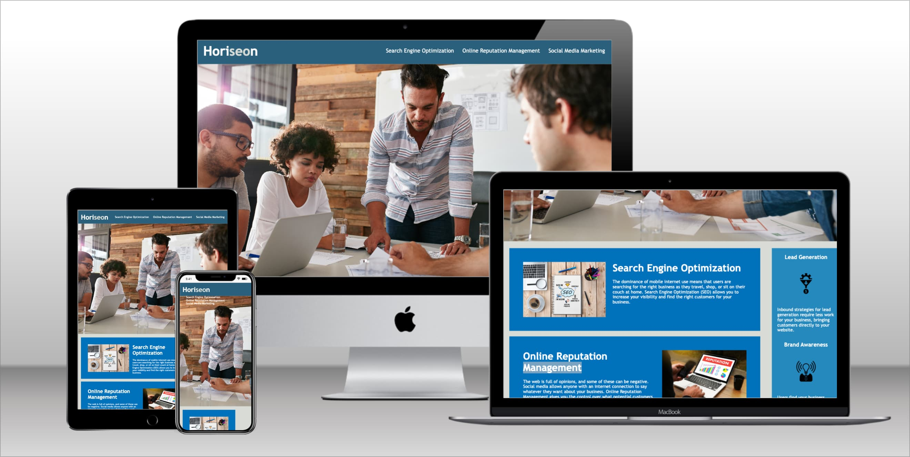

# Horiseon Agency Website

## Overview
Welcome to the repository of the Horiseon Agency website! Horiseon is a fictional marketing agency considered for this challenge. 

This project encompasses a fully accessible and SEO-friendly website for Horiseon, a leading digital marketing agency. The focus is on ensuring a high-quality web presence that is inclusive for all users, and making it optimized for search engines.

## Website Preview

Here's a look at the new Horiseon Agency website:

## Features
- **Accessibility**: The site is designed to be fully accessible, including support for screen readers, keyboard navigation, and enhanced visual contrast.
- **SEO Optimization**: Carefully structured for optimal search engine performance.
- **Responsive Design**: The website is fully responsive and adapts to various screen sizes and devices.

## Technologies Used
- HTML5
- CSS3

 

## Usage

This website is intended as an online presence for Horiseon Agency, showcasing their services in digital marketing. It serves as a point of contact for potential clients and provides insights into the services offered.

## License

Distributed under the MIT License. See LICENSE for more information.

## Contact

Pradeep Singh - pradeep@pradeep.co

Project Link: https://pradeepdotco.github.io/horiseon-accessible-website/